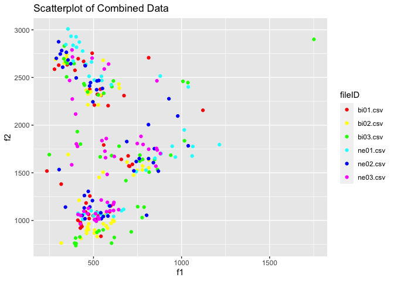
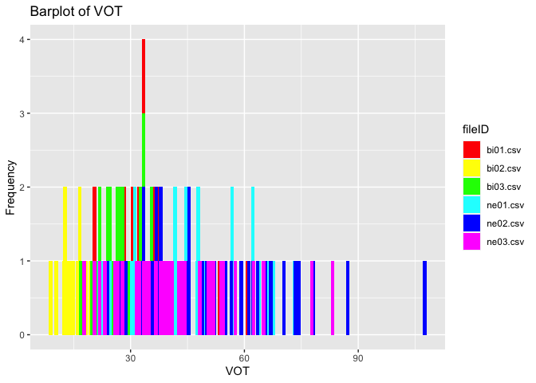

Programming assignment 4
================

**Author**: Hunter Metz **Date**: Last update: 2024-04-15
19:41:06.893581

# Overview

<!-- 
  Talk briefly about what you did here 
  Describe your hypotheses
-->

In pa_4 I segmented in Praat, 6 participants: 3 are native bilinguals,
and 3 are L2 learners of Spanish. I segmented by marking the start of
the VOT, end of the VOT, and the vowel length. I ran 3 praat scripts for
this data. Firstly, I ran a script that normalized peak intensity.
Secondly, ran a script that create the textgrids to segment the data.
Thirdly, I ran a script that extracted the values into csv files. Then
in Rstudio I combined the csv files into one files to look at the data.
I then created scatterplots for f1 and f2. Then I plotted a scatterplot
and bar graph for the vot, and briefly talked about some of the data
with a descripitive summary.

Hypothesis: The L2 learners of Spanish will have a longer VOT due to the
fact that English has a longer VOT than Spanish.

# Prep

## Libraries

## Load data

``` r
# You need to get all the files in the 'data' directory and combine them
# Check previous examples we did in class 
# Set the directory where your CSV files are located
directory <- "/Users/huntermetz/Desktop/pa_4/data/"

#
# List of the file names
file_names <- c("bi01.csv", "bi02.csv", "bi03.csv", "ne01.csv", "ne02.csv", "ne03.csv")

# List to store data frames
data_frames <- list()

# Loop through each file and read into a data frame
for (file in file_names) {
    # Read CSV file into a data frame
    data <- read_csv(file.path(directory, file))
    # Store the data frame in the list with file name
    data_frames[[file]] <- data
}
```

    ## Rows: 45 Columns: 5
    ## ── Column specification ────────────────────────────────────────────────────────
    ## Delimiter: ","
    ## chr (1): fileID
    ## dbl (3): f1, f2, vot
    ## lgl (1): notes
    ## 
    ## ℹ Use `spec()` to retrieve the full column specification for this data.
    ## ℹ Specify the column types or set `show_col_types = FALSE` to quiet this message.
    ## Rows: 45 Columns: 5
    ## ── Column specification ────────────────────────────────────────────────────────
    ## Delimiter: ","
    ## chr (1): fileID
    ## dbl (3): f1, f2, vot
    ## lgl (1): notes
    ## 
    ## ℹ Use `spec()` to retrieve the full column specification for this data.
    ## ℹ Specify the column types or set `show_col_types = FALSE` to quiet this message.
    ## Rows: 45 Columns: 5
    ## ── Column specification ────────────────────────────────────────────────────────
    ## Delimiter: ","
    ## chr (1): fileID
    ## dbl (3): f1, f2, vot
    ## lgl (1): notes
    ## 
    ## ℹ Use `spec()` to retrieve the full column specification for this data.
    ## ℹ Specify the column types or set `show_col_types = FALSE` to quiet this message.
    ## Rows: 45 Columns: 5
    ## ── Column specification ────────────────────────────────────────────────────────
    ## Delimiter: ","
    ## chr (1): fileID
    ## dbl (3): f1, f2, vot
    ## lgl (1): notes
    ## 
    ## ℹ Use `spec()` to retrieve the full column specification for this data.
    ## ℹ Specify the column types or set `show_col_types = FALSE` to quiet this message.
    ## Rows: 45 Columns: 5
    ## ── Column specification ────────────────────────────────────────────────────────
    ## Delimiter: ","
    ## chr (1): fileID
    ## dbl (3): f1, f2, vot
    ## lgl (1): notes
    ## 
    ## ℹ Use `spec()` to retrieve the full column specification for this data.
    ## ℹ Specify the column types or set `show_col_types = FALSE` to quiet this message.
    ## Rows: 45 Columns: 5
    ## ── Column specification ────────────────────────────────────────────────────────
    ## Delimiter: ","
    ## chr (1): fileID
    ## dbl (3): f1, f2, vot
    ## lgl (1): notes
    ## 
    ## ℹ Use `spec()` to retrieve the full column specification for this data.
    ## ℹ Specify the column types or set `show_col_types = FALSE` to quiet this message.

## Tidy data

``` r
# Convert from long to wide or wide to long format as necessary (check 
# examples from class)
# Create any other relevant variables here 

# I wasn't sure what the tidy data, but I did my best to present of the data cohesively, and described the VOT data the best that I could below. 
```

# Analysis

## Descriptives

``` r
# Give some descriptive summaries of your data 
# Display your descriptives in a table (try knitr::kable())
# My descriptive data is just below in visualization
```

## Visualization

``` r
# Include some plots here
#  plots here
library(ggplot2)

# create scatterplot
create_scatterplot <- function(data, file_id) {
  ggplot(data, aes(x = f1, y = f2)) +
    geom_point() +
    labs(title = file_id)
}

# Loop through data frame and creation of scatterplot
for (file_id in names(data_frames)) {
  plot <- create_scatterplot(data_frames[[file_id]], file_id)
  print(plot)
}
```


``` r
library(dplyr)
```

    ## 
    ## Attaching package: 'dplyr'

    ## The following objects are masked from 'package:stats':
    ## 
    ##     filter, lag

    ## The following objects are masked from 'package:base':
    ## 
    ##     intersect, setdiff, setequal, union

``` r
library(ggplot2)

# Combine data frames into one
combined_data <- bind_rows(data_frames, .id = "fileID")

# Create scatterplot
scatterplot <- ggplot(combined_data, aes(x = f1, y = f2)) +
  geom_point() +
  labs(title = "Scatterplot of CSV Files", x = "f1", y = "f2") +
  facet_wrap(~ fileID, nrow = 2)

# Print the scatterplot
print(scatterplot)
```


``` r
library(ggplot2)
```

``` r
library(ggplot2)

# Create scatterplot of the combined data with color
scatterplot_colored <- ggplot(combined_data, aes(x = f1, y = f2, color = fileID)) +
  geom_point() +
  labs(title = "Scatterplot of Combined Data", x = "f1", y = "f2") +
  scale_color_manual(values = rainbow(length(unique(combined_data$fileID))))

# Print the scatterplot
print(scatterplot_colored)
```

<!-- -->

``` r
library(ggplot2)

# Create bar plot
barplot_thick <- ggplot(combined_data, aes(x = vot, fill = fileID)) +
  geom_bar(width = 0.9) +  # Adjust for thick bars
  labs(title = "Barplot of VOT", x = "VOT", y = "Frequency") +
  scale_fill_manual(values = rainbow(length(unique(combined_data$fileID))))

# Print the bar plot
print(barplot_thick)
```

    ## Warning: `position_stack()` requires non-overlapping x intervals

<!-- -->

``` r
#Descriptive summary: Here we are able to see here and revisit the hypothesis that the L2 learners had a longer VOT time than the bilinguals. We can see that ne02 had a markedly longer VOT time than the other speakers, as well as ne02 having a longer VOT time than much of the participants. And, as well as ne01 having a longer VOT time than the majority of the bilinguals. For the bilinguals we can see that there VOT time was mostly all in the same place, on the bar-plot which I found interesting as it is more consistent. The variability in the VOT of the L2 can be due to the fact that if their L1 is English, English has a longer VOT time than Spanish. But if their L1 isn't English it could increase the variability as well. 
```

<!-- 
Also include a professional looking figure illustrating an example of the acoustics 
of the production data, i.e., a plot generated in praat.
You decide what is relevant (something related to your hypothesis). 
Think about where this file should be located in your project. 
What location makes most sense in terms of organization? 
How will you access the file (path) from this .Rmd file?
If you need help consider the following sources: 
  - Search 'Rmarkdown image' on google, stackoverflow, etc.
  - Search the 'knitr' package help files in RStudio
  - Search the internet for HTML code (not recommended, but it works)
  - Check the code from my class presentations (may or may not be helpful)
  # I wasn't able to figure out how to get the accoustics photo. 
-->

## Hypothesis test

``` r
# Conduct a simple statistical analysis here (optional)
```

# Conclusion

<!-- 
Revisit your hypotheses (refer to plots, figures, tables, statistical tests, 
etc.)
&#10;Reflect on the entire process. 
What did you enjoy? What did you hate? What did you learn? 
What would you do differently?
-->

I enjoyed viewing all of the data in the csv files and comparing the
bilingual speakers vs the L2. It was difficult working with the Praat
scripts. Praat is very finicky with code, so I was having some issues,
but I had to reread the code over and over again and make sure that it
was correct. I learned that coding overall is a process that takes time
and critical thinking, because I missed a hashtag which was causing
issues. Sometimes a large issue is really a small syntax issue that can
be resolved quickly by reading everything very slowly. Next time, I
would read over things more and make sure that I am not making small
syntax errors which would have made this project go over more smoothly.
Overall, my takeaway is that coding is often a time consuming process,
but seeing the end result with all of the raw data in this case was very
rewarding. Coding is also very practical because I feel this is
something that I will take in my future, and when you don’t know the
answer you can simply Google questions, which I did a lot in this
project, because I felt lost sometimes. It is also even more rewarding
when I felt I did the best that I could, even thought I wasn’t able to
figure out everything that I was tasked with, I apologize. Regarding my
hypothesis, it was so interesting to see that my hypothesis was correct
and that the VOT times were in fact longer for the L2 learners, and see
the raw data in the bar-plots.

</br></br>
